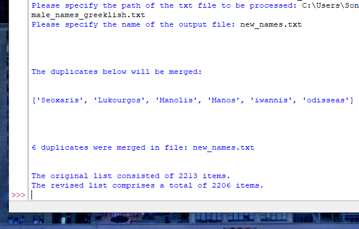

# duplicate_merge

## Description

This is a simple application in Python for locating duplicates in a wordlist, merging them
and sorting the final list in alphabetical order.

This tool and the consequent list can serve multiple purposes, such as cybersecurity projects (dictionary attacks etc.) 

You can see a sample of the application running below:

## Usage

The wordlist should be imported in txt format and each word should be presented on a seperate line.

## License

This project is licensed under the [MIT License](LICENSE). You are free to use, modify, and distribute this project as per the terms of the license.

## Contact

alexandrosb88@gmail.com

